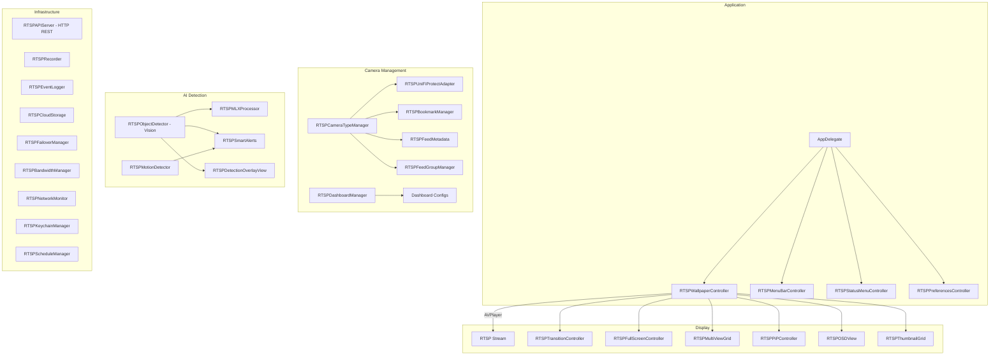

# RTSP Rotator

**macOS RTSP camera feed viewer with AI-powered object detection**

[](https://opensource.org/licenses/MIT)


A native macOS application for viewing, rotating, and monitoring RTSP camera feeds. Supports multi-view grids, picture-in-picture, PTZ control, motion detection, AI object detection via Vision and MLX, UniFi Protect integration, recording, smart alerts, and dashboard management. Built in Objective-C with zero third-party dependencies.

---

## Architecture



---

## Features

| Category | Details |
|----------|---------|
| **Feed Rotation** | Automatic cycling through RTSP/HTTP camera feeds with configurable interval |
| **Multi-View Grid** | 2x2, 3x3, or custom grid layouts showing multiple cameras simultaneously |
| **Picture-in-Picture** | Floating PiP window for any camera feed |
| **Full Screen** | Dedicated full-screen mode with OSD overlay |
| **PTZ Control** | Pan, tilt, zoom control for supported cameras |
| **Transitions** | Animated transitions between feed switches |
| **AI Object Detection** | Vision framework (VNDetectHumanBodyPose, VNClassifyImage) for real-time detection |
| **MLX Processing** | Apple Silicon ML inference via Python bridge for advanced detection |
| **Motion Detection** | Frame-difference motion detection with configurable sensitivity |
| **Smart Alerts** | Notification system triggered by object detection and motion events |
| **Detection Overlay** | Bounding box and annotation overlay on live feeds |
| **UniFi Protect** | Native integration with Ubiquiti UniFi Protect controllers |
| **Camera Types** | Auto-detection and configuration for different camera manufacturers |
| **Bookmarks** | Save and organize favorite camera feeds |
| **Feed Groups** | Group cameras by location or purpose |
| **Dashboards** | Multiple saved dashboard configurations with different camera layouts |
| **Recording** | Record RTSP streams to local files |
| **Audio Monitor** | Monitor audio levels from camera feeds |
| **Snapshots** | Capture still frames from live feeds |
| **Event Logging** | Persistent log of detection events, alerts, and camera status changes |
| **Cloud Storage** | Export recordings and snapshots to cloud storage |
| **Configuration Export** | Import/export camera configurations as files |
| **CSV Import** | Bulk import camera feeds from CSV files |
| **REST API** | HTTP API server for remote control (feed switching, recording, snapshots) |
| **Failover** | Automatic reconnection and failover for dropped streams |
| **Bandwidth Manager** | Monitor and limit network bandwidth per stream |
| **Network Monitor** | Track connection status and latency |
| **Schedule Manager** | Time-based recording and alert schedules |
| **Keychain Storage** | macOS Keychain for all camera credentials |
| **Global Shortcuts** | System-wide keyboard shortcuts for common actions |
| **Themes** | Glassmorphic UI with dark mode support |

---

## REST API

| Endpoint | Method | Description |
|----------|--------|-------------|
| `/api/feeds` | GET | List all configured camera feeds |
| `/api/feeds/current` | GET | Current feed index |
| `/api/feeds/next` | POST | Switch to next feed |
| `/api/feeds/previous` | POST | Switch to previous feed |
| `/api/feeds/{index}` | POST | Switch to specific feed |
| `/api/snapshot` | POST | Capture snapshot |
| `/api/recording/start` | POST | Start recording |
| `/api/recording/stop` | POST | Stop recording |
| `/api/recording/status` | GET | Recording state |
| `/api/rotation/interval` | POST | Set rotation interval |

Optional API key authentication. Configurable port (default 8080).

---

## Requirements

- macOS 14.0 (Sonoma) or later
- Xcode 15.0+ (build from source)
- RTSP-capable cameras on local network

---

## Build

```bash
git clone git@github.com:kochj23/RTSP-Rotator.git
cd "RTSP Rotator"
open "RTSP Rotator.xcodeproj"
# Cmd+R to build and run
```

Zero external dependencies. Apple frameworks only: Cocoa, AVFoundation, Vision, Network, Security, UniformTypeIdentifiers.

**Codebase:** 100 source files, ~21,000 lines of Objective-C.

---

## Test Suite

242 XCTest cases across 8 test suites.

| Suite | Tests | Description |
|-------|-------|-------------|
| Core | 20 | Controller init, feed rotation, URL validation, mute, performance |
| CSV Import | 24 | CSV parsing, quoted fields, comments, URL formats, bulk import |
| Comprehensive | 90 | Full feature coverage across all managers |
| Configuration | 31 | Export/import, dashboard configs, preferences |
| Integration | 12 | End-to-end feed loading, rotation, multi-view |
| URL Security | 18 | RTSP URL validation, credential stripping, injection prevention |
| Keychain | 32 | Credential storage, retrieval, deletion, edge cases |
| Memory Management | 15 | Retain cycles, leak detection, deallocation |
| **Total** | **242** | |

```bash
xcodebuild test -scheme "RTSP Rotator" -sdk macosx \
  -destination "platform=macOS"
```

---

## Security

- All camera credentials stored in macOS Keychain via RTSPKeychainManager.
- URL security validation prevents credential exposure in logs.
- No hardcoded passwords or API keys.
- Local API server supports optional API key authentication.
- ATS exceptions scoped to local network addresses only.

---

## License

MIT License. See [LICENSE](LICENSE).

Copyright (c) 2025 Jordan Koch.

---

Written by **Jordan Koch** ([@kochj23](https://github.com/kochj23))
